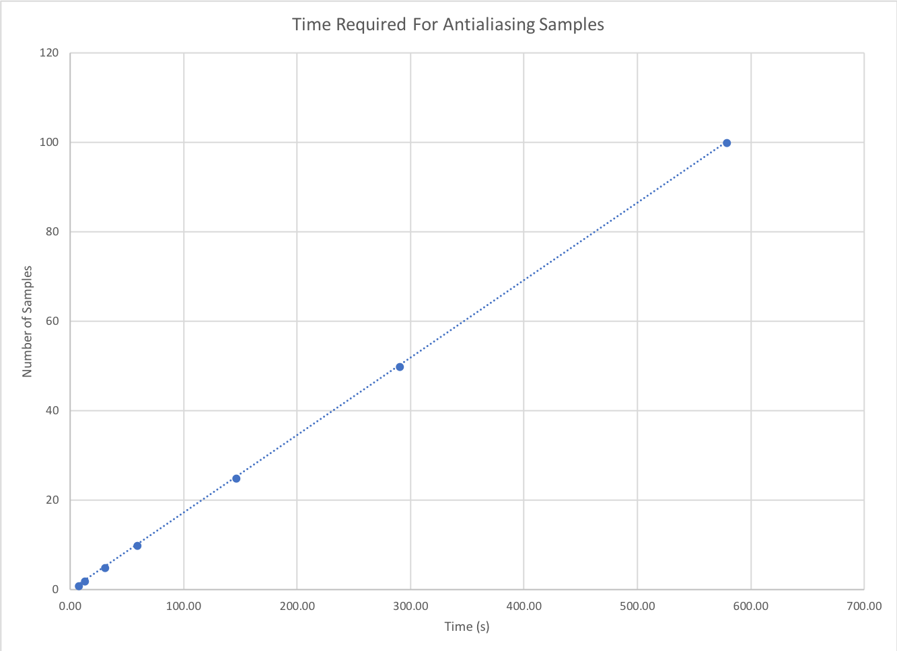

# Simple Raytracer

## Requirements
- [x] Loads a scene file
- [x] Uniformly sends out rays from each pixel in the image plane
- [x] Handles object intersections
- [x] Computes illumination (using Phong)
- [x] Renders the scene

## Bonus Requirements

- [ ] Recursive reflection
- [x] Good anti-aliasing
- [ ] Soft shadows

## Architecture

The ray tracer is implemented using object oriented programming principles. The various responsibilities of program are spread among different classes:
- **Camera**: a struct for storing camera data
- **Light**: a struct for light data
- **Plane**: a struct for plane data and operations (normal and intersections)
- **Ray**: a struct for ray data and operations
- **Scene**: a struct for scene data and operations which hold scene objects, lights and camera.
- **SceneObject**: a base object from all objects in the scene (planes and spheres)
- **SceneReader**: class responsible for reading scene from a file
- **Sphere**: a struct for plane data and operations (normal and intersections)

## Implementation

### Displaying the image

Displaying the image is accomplished using the CImg library. In addition to displaying the image in a CImg window, the image is also saved to file.

### Ray tracing

The ray tracer sends a ray for each pixel of the image by starting at the top left corner of the image from left -> right, top -> bottom. The basic steps are:
1. Generate a ray for a pixel
2. Compute a color for the pixel
    1. Check if the ray intersects with an object
    2. If ray intersects compute color using phong else use background color
    3. For phong lighting, send shadow rays to all lights, to check for intersection
    4. If ray intersects infront of light, object is in shadow else object is lit
3. Clamp the color between [0.0, 1.0]

## Extra Tricks

### Shadow Bias

The t value from the intersection of a ray has a small bias to reduce shadow acne.

## Bonus Features

### Antialiasing

The antialiasing is implemented as an extra for loop that sends multiple rays per pixel and takes the average color from all the rays. The more samples improves the image aliasing at the cost of longer computation time as shown below:

| # of Samples | Elapsed Time (s) |
|:------------:|:----------------:|
| 1            | 6.11             |
| 2            | 11.94            |
| 5            | 29.30            |
| 10           | 58.07            |
| 25           | 144.94           |
| 50           | 289.44           |
| 100          | 577.50           |

